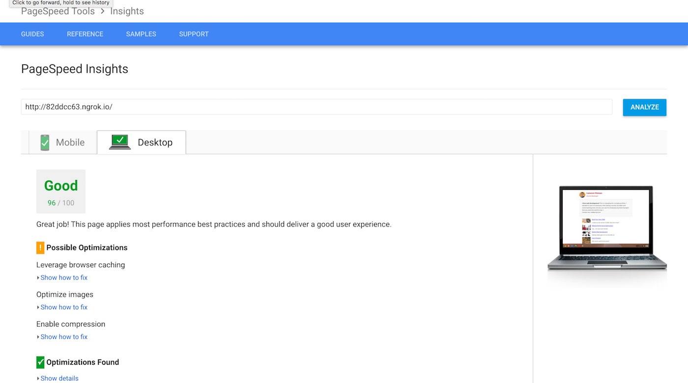
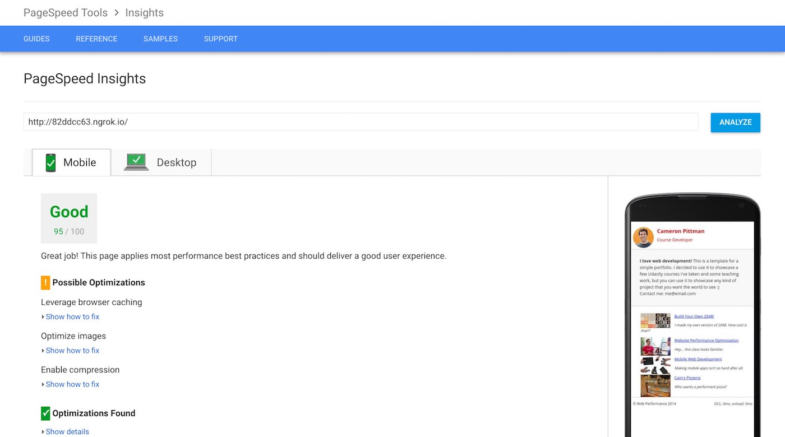

## Website Performance Optimization Project
> Udacity Frontend Nanodegree Project 6

This Project is focused on implementing good web performance. I was given an intentionally slow website, and I had to find what was causing this bad performance and fix it. The website was slow in 2 different aspects first was the initial loading speed and the second was the animation and rendering speed. I used the skills that I learn to get the following results in [Google's PageSpeed Insights](https://developers.google.com/speed/pagespeed/insights/) and to create a smooth rendering experience.

|  Platform | Results  |
| ------ | ------- |
| Desktop |  |
| Mobile  |  |


## Getting Started
To get started you need to have [npm](https://www.npmjs.com/) and [gulp](http://gulpjs.com/) installed on your computer. Once you have that installed clone this repository and run these commands in the terminal from the root directory.

```ssh
$ npm install
$ gulp build
$ cd dist/
$ python -m SimpleHTTPServer 8080
```
Once those commands are finished, open you browser and goto `localhost:8080`

## Development
These are the implementations that I made to optimize this website. I used the techniques that I learn from Udacity Frontend Nanodegree and tools like gulp and imageMagick to make the site render as fast as possible.

### Gulp Optimizations
I used gulp to minify all .js, .css and .html files and moved all the files to a dist folder. I also used imageMagick to optimize all .png and .jpg images

### Loading Speed Optimizations
Optimized the [index.html](src/index.html) file by first adding a media query on the necessary link tags like so

```html
<link href="css/print.css" rel="stylesheet" media="print">
```

I also added the async attribute to google-analytics script tag and the js/perfmatters.js script tag, and I also move the google-analytics initialization to the end of the body

```html
<script async src="http://www.google-analytics.com/analytics.js"></script>
<script async src="js/perfmatters.js"></script>
```

For the google fonts I used google's webfont loader to load fonts asynchronously

```html
<script async src="https://ajax.googleapis.com/ajax/libs/webfont/1.6.26/webfont.js"></script>
```

### Rendering Optimizations
For [main.js](src/views/js/main.js) file the main problems that I found were all the force reflows in the changePizzaSizes, determineDx, and updatePositions functions.

In the changePizzaSizes I moved all querySelectorAll and offsetWidth calls before the for loop like so

```js
var pizzas = document.querySelectorAll(".randomPizzaContainer");
var offsetWidth = pizzas[0].offsetWidth;
var windowWidth = document.querySelector("#randomPizzas").offsetWidth;

for (var i = 0; i < pizzas.length; i++) {
  var dx = determineDx(pizzas[i], offsetWidth, windowWidth, size);
  var newwidth = (offsetWidth + dx) + 'px';
  pizzas[i].style.width = newwidth;
}
```

In the updatePositions function I also moved scrollTop outside the for loop like so

```js
var items = document.querySelectorAll('.mover');
var scrollTop = document.body.scrollTop
for (var i = 0; i < items.length; i++) {
  var phase = Math.sin((scrollTop / 1250) + (i % 5));
  items[i].style.left = items[i].basicLeft + 100 * phase + 'px';
}
```

## Dependencies
* [Python2](https://www.python.org/downloads/)
* [NPM](https://www.npmjs.com/)
* [Gulp](http://gulpjs.com/)
